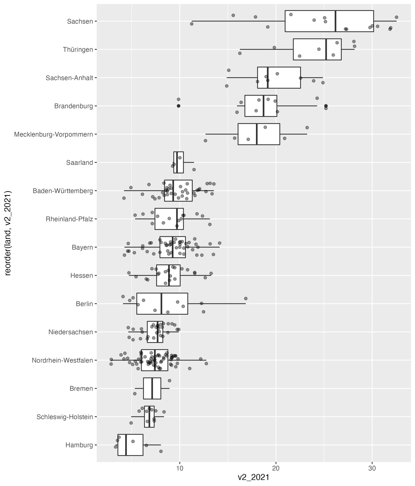

```{r setup, include = FALSE}
library(tidyverse)
library(readxl)
library(kableExtra)
library(DT)

btw2017 <- read_excel("../../_src/btw2017.xlsx", sheet = "btw2017", skip = 1) %>% 
  select(land = 1, cdu = 4, spd = 6, afd = 8, fdp = 10, pds = 12, gru = 14) %>% 
  separate(land, into = c("land", "land_short"), sep = " ") %>% 
  mutate(land_short = str_remove_all(land_short, "\\(|\\)")) %>% 
  pivot_longer(
    cols = cdu:gru,
    names_to = "party",
    values_to = "voteshare"
  ) %>% 
  mutate(
    voteshare = parse_number(voteshare, locale = locale(decimal_mark = ","))
  ) 

btw2017_ordered <- btw2017 %>% 
  filter(party == "afd") %>% 
  arrange(desc(voteshare))
```

# Daten
Der Datensatz heißt `btw2017`.

Es liegen Informationen zu insgesamt `r length(unique(btw2017$land))` Bundesländern vor.

Es liegen Informationen zu insgesamt `r unique(btw2017$land) %>% length()` Bundesländern vor.

Die Bundesländer sind u.a.:
- [Berlin](https://de.wikipedia.org/wiki/Berlin)
- Baden-Württemberg
- Hamburg

- aus dem Osten:
  - Sachsen
  - Thüringen

- aus dem Westen:
  - Bayern
    - Hessen
      - Saarland
      
1. Thüringen
2. Hessen
      
### eine Tabelle    
```{r}    
kable(btw2017_ordered[c("land_short", "voteshare")],
      col.names = c("Bundesland", "Anteil"),
      caption = "Stimmenanteil der AfD zur BTW 2017")
```

### eine schickere Tabelle

```{r}    
kable(btw2017_ordered[c("land_short", "voteshare")],
      col.names = c("Bundesland", "Anteil"),
      caption = "Stimmenanteil der AfD zur BTW 2017") %>% 
  kable_styling(position = "left", bootstrap_options = c("striped", "hover"), full_width = FALSE)
```


### AfD-Resultate über eine externe Grafik laden



### AfD-Resultate über eine eigene Grafik generieren

Am stärksten  [**schneidet die AfD**]{style="color: green;"} in `r btw2017_ordered$land[[1]]` ab, am [**schwächsten**]{style="color:orange;"} in `r btw2017_ordered$land[[16]]`.

Es zeigt sich ein klares Muster: Im [**Westen der Republik**]{style="color: red;"} schneidet die AfD schlechter ab, als im Westen. Eindrucksvoll ist die Streuung in Sachsen.

<center>
```{r, fig.align='center', fig.width = 6, fig.height = 6, fig.cap = "Stimmenanteile der AfD", echo=FALSE, message=FALSE, warning = FALSE}
btw2017 %>% 
  filter(party == "afd") %>% 
  ggplot(aes(x = reorder(land, voteshare),  y = voteshare)) +
  geom_col() +
  coord_flip() +
  theme_minimal()
``` 
</center>

# chunk-Options
Code             | Code is run | Code appears in report | Results appear in report
---------------- |:----------- |:---------------------- | :----------------------:
include = FALSE  | Yes         | No                     | No
echo = FALSE     | Yes         | No                     | Yes
eval = FALSE     | No          | Yes                    | No
----------------------------------------------------------------------------------

