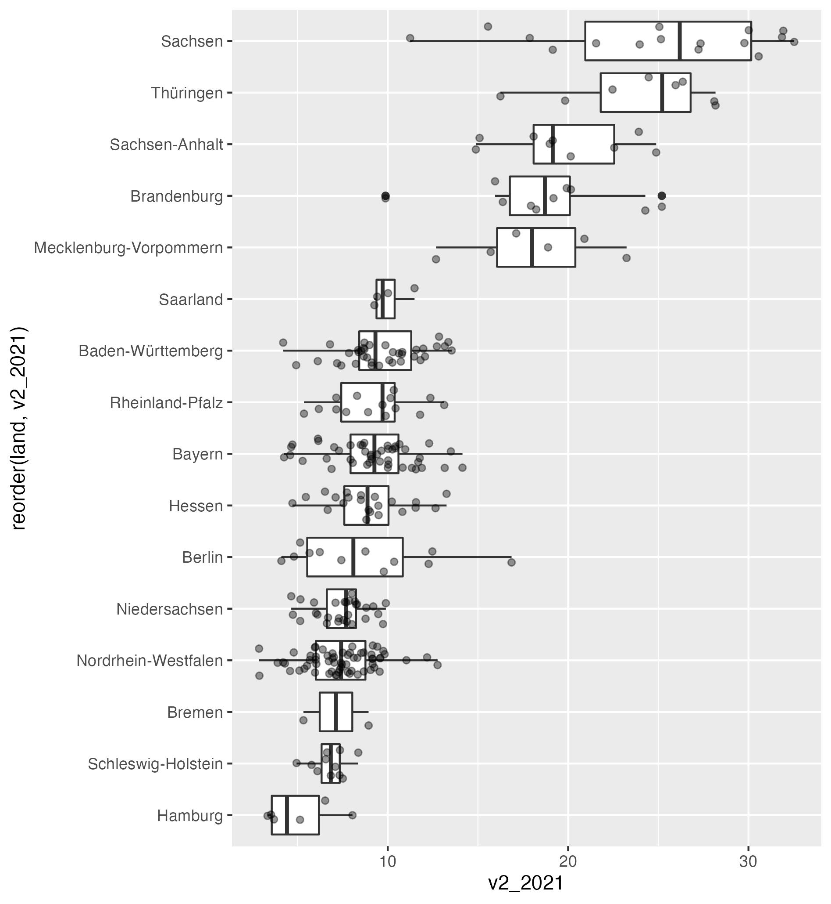

# Daten
Der Datensatz heißt `btw2017`.

Es liegen Informationen zu insgesamt `r length(unique(btw2017$land))` Bundesländern vor.

Es liegen Informationen zu insgesamt `r unique(btw2017$land) %>% length()` Bundesländern vor.

Die Bundesländer sind u.a.:
- [Berlin](https://de.wikipedia.org/wiki/Berlin)
- Baden-Württemberg
- Hamburg

- aus dem Osten:
  - Sachsen
  - Thüringen

- aus dem Westen:
  - Bayern
    - Hessen
      - Saarland
      
1. Thüringen
2. Hessen
      
### eine Tabelle    
```{r}    
kable(btw2017_ordered[c("land_short", "voteshare")],
      col.names = c("Bundesland", "Anteil"),
      caption = "Stimmenanteil der AfD zur BTW 2017")
```

### eine schickere Tabelle

```{r}    
kable(btw2017_ordered[c("land_short", "voteshare")],
      col.names = c("Bundesland", "Anteil"),
      caption = "Stimmenanteil der AfD zur BTW 2017") %>% 
  kable_styling(position = "left", bootstrap_options = c("striped", "hover"), full_width = FALSE)
```


### eine interaktive Tabelle

```{r}    
btw2017 %>% 
  datatable(
    class = 'cell-border stripe',
    filter = 'top',
    options = list(
      pagelength = 5,
      searchHighlight = TRUE)
  )
```


### AfD-Resultate über eine externe Grafik laden



### AfD-Resultate über eine eigene Grafik generieren

Am stärksten  [**schneidet die AfD**]{style="color: green;"} in `r btw2017_ordered$land[[1]]` ab, am [**schwächsten**]{style="color:orange;"} in `r btw2017_ordered$land[[16]]`.

Es zeigt sich ein klares Muster: Im [**Westen der Republik**]{style="color: red;"} schneidet die AfD schlechter ab, als im Westen. Eindrucksvoll ist die Streuung in Sachsen.

<center>
```{r, fig.align='center', fig.width = 6, fig.height = 6, fig.cap = "Stimmenanteile der AfD", echo=FALSE, message=FALSE, warning = FALSE}
plot_btw2017
``` 
</center>

# chunk-Options
Code             | Code is run | Code appears in report | Results appear in report
---------------- |:----------- |:---------------------- | :----------------------:
include = FALSE  | Yes         | No                     | No
echo = FALSE     | Yes         | No                     | Yes
eval = FALSE     | No          | Yes                    | No
----------------------------------------------------------------------------------

